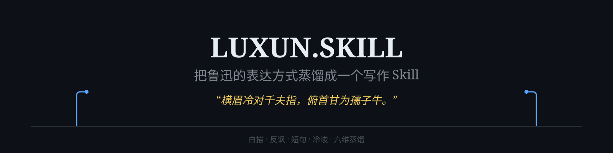

 

# 🖋️ luxun-skill

### *"Fierce-browed, I coolly defy a thousand pointing fingers; head bowed, like a willing ox I serve the children."*

 

<table>
<tr><td align="left">

✍️ &nbsp;You want to **write like Lu Xun** — calm plain-style narration, understated irony, short-sentence rhythm — but every draft turns into a quote-quilt of his famous lines? 
🗞️ &nbsp;You want him to **comment on today** — to look at the crowd, the silence, the self-deception through his eyes? 
🧩 &nbsp;You want to **distill a Lu Xun-style Skill** — not mimic his tone, but reproduce his mental models and expression framework?

</td></tr>
</table>

### ✨ That's what luxun-skill does.

 

**Source material + six-dimension research → a writing Skill that genuinely thinks like him.**

It does not collect quotes. It extracts the **expression framework** — the way he sees problems, the way he builds a sentence, the way he ends a paragraph.

[📖 Distillation Record](../docs/DISTILLATION.md) · [📋 PRD](../docs/PRD.md) · [🗺️ Roadmap](../ROADMAP.md) · [💬 Demo](../examples/demo.md)

[**中文**](../README.md)

---

> 📝 **2026.07.01 Update — v1.0 released**: Distilled with the [dot-skill engine](https://github.com/titanwings/colleague-skill) celebrity six-dimension research flow. Source: the 18-volume *Complete Works of Lu Xun* (local full text). Output: a two-layer Skill (Work writing methodology + Persona cognitive signature), passing 13 quality checks with a hard "techniques stay invisible" constraint.

---

## What this is

A **person** distilled into a **writing capability**.

From *Call to Arms*, *Wandering*, *Wild Grass*, *Dawn Blossoms Plucked at Dusk*, to the sixteen essay collections, Lu Xun's written expression is decomposed into three parts:

| Part | Content | Purpose |
|------|---------|---------|
| **PART A — Writing methodology** | Plain-style narration, irony, parallelism, metaphor, ending technique | "How to write" — your writing toolbox |
| **PART B — Cognitive signature** | Mental models, decision habits, expression DNA, honest boundaries | "How to think" — his frame for problems |
| **Operating rules** | Invisible techniques, no self-review about writing, Layer 0 first | Make sure the output sounds like *him*, not like "an AI imitating him" |

> ⚠️ This Skill does **not** reproduce quotes. It extracts the expression framework — you can write entirely new content with it, and the content belongs to you.

## Distillation method

See [docs/DISTILLATION.md](../docs/DISTILLATION.md) for the full record. At its core is the dot-skill engine's **celebrity six-dimension research**:

1. **Writings** — systematic positions (the "cannibal" ritual critique, "stand the person" thought, "take-it-ism", resistance to despair)
2. **Conversations** — polemic style (with Liang Shiqiu et al.), lecture records
3. **Expression DNA** — linguistic fingerprint (classical-modern fusion, plain-style narration, irony, parallelism, color, name-sentence endings) ← the core
4. **Decisions** — giving up medicine for literature, "leaving the old road", living by the pen, the "standing across" posture
5. **External views** — Mao Zedong, Yu Dafu, and his opponents' criticism (kept as contrast)
6. **Timeline** — creative era → *Wild Grass* era → essay era (shorter and harder over time)

Research notes stay in [`knowledge/research/`](../knowledge/research/) — auditable and reproducible.

## Install

In 2026 — you have an Agent, let it install itself. Say to your Agent (DeepSeek Harness / Claude Code / OpenClaw / Codex):

> Install the luxun-skill for me: `https://github.com/titanwings/luxun-skill`

Or clone manually:

| Host | `<TARGET>` |
|------|-----------|
| DeepSeek Harness | `~/.dsh/skills/luxun-skill` (global) or `.dsh/skills/luxun-skill` (project) |
| Claude Code | `~/.claude/skills/luxun-skill` |
| OpenClaw | `~/.openclaw/workspace/skills/luxun-skill` |
| Codex | `~/.codex/skills/luxun-skill` |

## Usage

| Command | Description |
|---------|-------------|
| `@luxun-skill: write an essay about X` | Full call — methodology + Lu Xun's mindset + expression style |
| `@luxun-skill: revise this article` | Edit toward Lu Xun's expression level |
| `python tools/verify_skill.py SKILL.md` | Run the local quality gate (13 checks) |

Techniques stay invisible: the output never says "plain-style narration" or "irony", and never reviews its own writing.

## Honest boundaries

- Cannot reproduce his spoken voice (no recordings survive)
- Cannot replace the *Complete Works* itself — go to the original text for quotes
- For events after 1936, only reasoned extrapolation from his mental models (labeled as such)

## Citation & credits

Built with the **dot-skill engine** ([titanwings/colleague-skill](https://github.com/titanwings/colleague-skill)) six-dimension celebrity flow. Source: *Complete Works of Lu Xun* (People's Literature Publishing House, 18 volumes).

Created by [@yh-liao-07](https://github.com/yh-liao-07) · powered by [dot-skill](https://github.com/titanwings/colleague-skill)